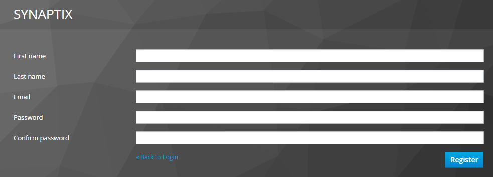
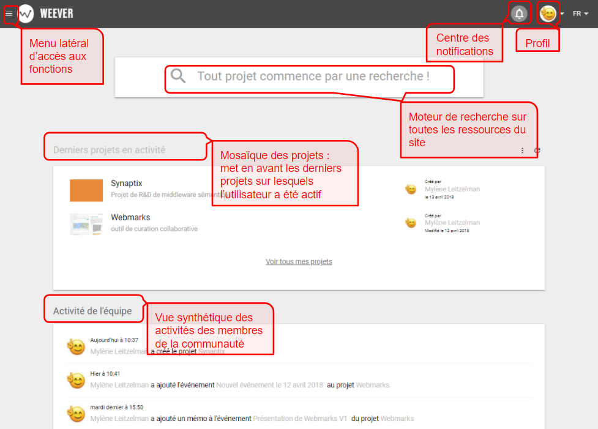
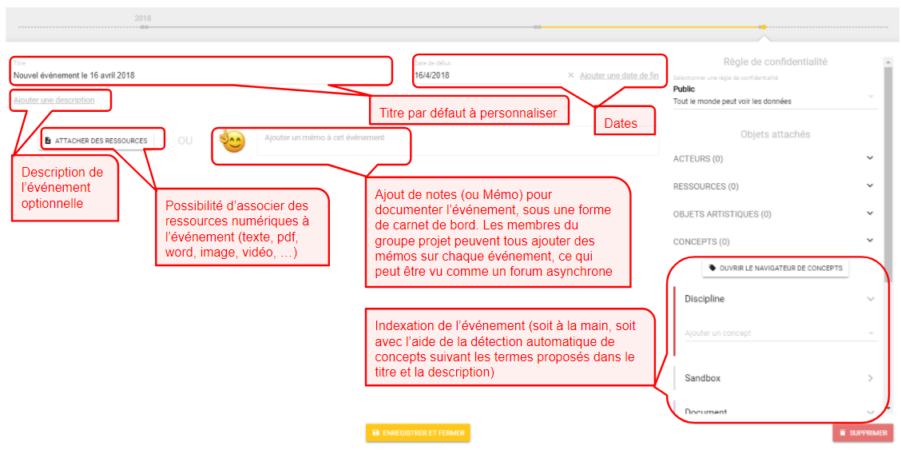

# Créer son premier projet

## Première connexion : création de compte

Nous utilisons un service capable de se connecter à différentes sources de données utilisateurs et qui propose des services d'authentification sécurisée pour les applications clientes comme Koncept et Weever.
 Pour se créer un compte, il faut suivre la procédure suivante :

1\) Créez un compte en cliquant sur "Register" : 

2\)  Ensuite, une fois le compte créé, ce dernier sera le même pour toutes les applications de Mnémotix

## Page Mon profil

Avant toute interaction sur la plateforme Weever, il est important de renseigner son profil, l'adresse mail étant remplie lors de la premier connexion à l'enregistrement. Les champs usuels téléphone et adresse sont proposés. Il y a aussi un champ dédié à une petite bio pour se présenter.


 Par défaut, l'avatar du menu Profil reprend la première lettre du prénom, mais nous conseillons de télécharger votre propre avatar ou photo pour améliorer l'expérience utilisateur dans la communauté des membres de la Plateforme


## Page d'accueil de Weever

### Le menu du haut

Pour accéder aux fonctionnalités de Weever, cliquez sur le Menu latéral en haut à gauche. Il se plie et se déplie par simple clic de souris sur le menu. Il propose un accès direct à toutes les fonctionnalités de Weever, que l'on retrouve aussi en naviguant dans l'interface.


Ce menu est plus ou moins conséquent en fonction des droits utilisateurs \(possibilité de créer un nouveau projet, un nouveau contact, un nouvel utilisateur ou un nouveau groupe\)


L'icône "cloche" vous notifie de toute nouvelle action sur le site \(téléchargement de nouvelles ressources, suivi d'activité etc..\), notifications qu'il est possible d'éteindre dans son Profil.

Vous pouvez à tout instant avoir accès et modifier votre profil \(voir le § [Page Mon profil](https://mnemotix.gitbook.io/weever/premiers-pas/premiers-pas-dans-weever#page-mon-profil)\).

### La page centrale

La mosaïque des projets s'ouvre automatiquement sur tous les projets auxquels vous avez participé dernièrement \(les vôtres et ceux qui vous ont acceptés comme membre\). Vous voyez également les dernières contributions des membres de la plateforme.

Enfin, le moteur de recherche vous permet une première navigation par mot-clé dans toutes les ressources du site \(voir le chapitre [Naviguer dans Weever](https://mnemotix.gitbook.io/weever/premiers-pas/naviguer-dans-weever)\).


**L'activité de l'équipe** présente les dernières actions des membres sur la plateforme. Il est possible de cliquer sur les éléments cliquables pour ouvrir directement les éléments nouveaux.


## Ajouter un nouveau projet

Suivant les droits utilisateurs qui vous ont été octroyés, vous avez la possibilité de créer un projet. Vous devez voir un icône Plus sur lequel il faut cliquer pour créer un nouveau projet.


Il est aussi possible de passer par le menu en haut à gauche de l'écran \(voir le lien Actions : Nouveau projet\)


La création d'un projet est très simple et demande juste de renseigner un titre et éventuellement une description. Par défaut une couleur est associée pour personnaliser le projet dans la mosaïque de la page d'accueil, mais il est possible dans la page **paramètres d'un projet** de changer la couleur par une image.

## Enrichir un projet

La page d'accueil d'un projet se présente principalement sous la forme d'une ligne de temps \(ou _timeline_\), qui regroupe chronologiquement des événements liés au projet. 

La présentation en timeline a été retenue comme une des meilleures fonctionnalités pour “raconter” l’histoire d’un projet. La narration avec les données \(_data storytelling_\) est une branche de la visualisation de l'information qui provient du journalisme informatique. Les visualisations narratives \(notamment sous forme de timeline\) sont conçues pour inviter les lecteurs à s’engager avec les données visualisées en établissant une connexion personnelle entre le lecteur et les données présentées.

### Les timelines d'un projet

La page projet présente deux lignes de temps, l'une verticale, qui se parcourt en scrollant avec la souris \(comme dans les principaux réseaux sociaux comme Facebook ou Twitter\), l'autre horizontale. Cette dernière suit la navigation verticale, c'est à dire que : 

* Les points sur la timeline horizontale représentent les événements du projet. 
* Les parties colorées sur la ligne sont les espaces temporels visibles à l'écran lorsque l'on scrolle verticalement, **pour toujours se repérer dans le temps du projet**.

Il est possible d'effectuer les opérations suivantes à partir de la timeline horizontale :  

* Cliquer sur un point "événement" ou sur la petite fenêtre présentant l'événement positionne la timeline verticale sur l'événement en question.
* Survoler un point "événement" donne un aperçu rapide des informations basiques sur cet événement.


Pour ouvrir l'événement à partir de la timeline horizontale, il faut cliquer sur le petit icône crayon jaune "Modifier"


### Ajouter un événement

A la création d'un projet, une invitation à créer votre premier événement s'inscrit sur la page d'accueil de la timeline \(icône jaune\). Sinon, pour ajouter d'autres événements, soit vous cliquez sur l'icône Plus, soit vous pouvez aussi vous positionner sur la timeline, et sélectionner la fenêtre en pointillée vous invitant à ajouter un événement : 


La possibilité d'ajouter un événement est conditionné au fait que vous ayez les droits utilisateurs pour contribuer au projet.


### Fenêtre d'un événement

La fiche d'un événement se présente sous la forme suivante \(a minima elle possède un titre par défaut ainsi qu'une date de début qu'il est possible de modifier ou de supprimer\) :

### Créer un Mémo

Un Memo permet d’attacher des textes enrichis à un événement, pour optimiser la collaboration des ****membres. L’idée est venu de dépasser l’activité d’être simplement documentaliste mais plutôt d’être le journaliste de sa propre activité.


Il s’agit d’un espace d’échange et de commentaires libres créé pour faciliter la documentation, comme un carnet de bord sur l'événement.


Un Memo se présente sous la forme d’une fenêtre de texte, rattachée à un événement. L'édition d'un mémo n'est autorisée qu'au créateur du mémo, de la même manière que sur un fil de discussion seul l'auteur peut modifier ses commentaires. Par contre, il est possible d'offrir un espace d'édition libre en créant plusieurs mémos ouvrant une discussion asynchrone entre plusieurs acteurs au sujet d’un événement \(on peut voir les différents Mémos ajoutés par les membres dans la rubrique Discussion, sous le Memo central dans la fenêtre de l'événement\).

**Ainsi un des buts recherchés est d’articuler les points de vue individuels des membres d’un projet avec un fil narratif global représentant un projet**.

Pour écrire un Memo, plusieurs possibilités : 

* directement à la création d'un événement, à partir de la fenêtre Evénement \(comme le montre la figure ci-dessus\)
* en cliquant sur le Plus dans la Timeline Discussion \(qui présente les différents acteurs ayant ajouté un Memo à propos de l'événement\)
* en cliquant sur le titre de l'événement, ce qui ouvre le Menu de l'événement sur l'onglet Memo \(comme le montre la figure ci-dessous\). On peut ainsi voir toutes les contributions textuelles faites par les membres du projet sur un événement particulier.


Le Memo permet d’ajouter des anecdotes sur le projet artistique, comme par exemple, des artistes influencés par les conditions de production de leur oeuvre du fait de contraintes extérieures, ce qui change la direction du projet etc…


Nous avons introduit dans l’écriture d’un mémo le fait de pouvoir sémantiquement lié des contacts cités \(membres de groupes projet, artistes ou acteurs extérieurs\) avec des ressources et/ou des concepts.

Pour ajouter un élément enrichi dans un Memo, plusieurs possibilités : 

* soit vous connaissez le terme, ou le contact, il vous suffit d'utiliser le caractère @ pour mentionner une personne ou le hastag \# pour mentionner un concept du thésaurus, la liste des personnes ou des concepts s'affiche en auto-complétion :  

* soit vous utilisez le menu du Memo : _1\)_ le premier icône est pour citer un concept du/des thésaurus associé à Weever dans votre communauté \(le navigateur de concept s'ouvre, pour plus de détail voir **En savoir plus /** [Indexation sémantique dans Weever](https://mnemotix.gitbook.io/weever/en-savoir-plus/indexation-semantique-dans-weever)\), _2\)_ le second icône est pour attacher une ressource \(il ouvre le navigateur de ressources\), _3\)_ le troisième icône est pour citer une personne \(il ouvre le carnet d'adresse lisant tous les acteurs, personnes ou organisations\), _4\)_ le dernier icône \(optionnel\) est pour citer un objet artistique \(une oeuvre ou une manifestation\)


L’évocation de personnes ou de concepts dans les mémos permet d’attacher automatiquement ces éléments aux événements du projet. Cet enrichissement sémantique sera exploitable soit pour des visualisations \(des liens entre éléments\), soit pour de la ré-éditorialisation de contenus \(via l'interrogation de l'API Weever\).


## Attacher des ressources

Weever a été conçu pour rendre compte en temps réel de la vie d'un projet artistique. Il s'agit de pouvoir attacher à chaque événement d'un projet des ressources média comme du texte, des documents, des mails, des photos ou des vidéos, …

### Plusieurs possibilités d'attachement

* **à la création d'un événement** : Il est possible d'attacher des ressources média \(textes, images, vidéos, pdfs, ...\) directement lors de la création d'un événement comme le montre l'image suivante :  

La page du **Menu d'un événement** apparaît positionnée sur l'onglet Ressources qui liste toutes les ressources déjà attachées à l'événement \(avec leur droit de confidentialité\). Pour en ajouter, il faut cliquer sur le Plus \(si les droits sont donnés\), ouvrant le navigateur de ressources \(voir le § [Le navigateur de ressources](https://mnemotix.gitbook.io/weever/premiers-pas/premiers-pas-dans-weever#le-navigateur-de-ressources)\).


Se reporter au chapitre [Naviguer dans Weever](https://mnemotix.gitbook.io/weever/premiers-pas/naviguer-dans-weever) pour plus de détail sur le Menu d'un événement. Egalement voir le chapitre **En savoir plus /**  [La gestion des droits](https://mnemotix.gitbook.io/weever/en-savoir-plus/gestion-des-droits) pour plus de détail sur les droits de confidentialité attachés aux ressources et autres éléments de Weever.


* **A partir d'un événement déjà ajouté dans la timeline du projet** : il faut cliquer sur l'icône jaune Ressource

* **En cliquant sur le titre de l'événement** : cette action ouvre le Menu de l'événement, il faut alors sélectionner l'onglet Ressources et cliquer sur le Plus \(si les droits sont donnés\)
* **En cliquant sur l'icône des ressources attachées sous l'événement** : cela ouvre directement le Menu de l'événement sur l'onglet Ressources

### Le navigateur de ressources

Le fait de cliquer sur le Plus lorsque l'on veut ajouter des ressources ouvre le Navigateur de ressources : 

Le navigateur regroupe toutes les ressources postées par les membres de la plateforme. Il est possible d'attacher des ressources déjà existantes à des événements. Pour cela, il suffit d'utiliser le moteur de recherche pour sélectionner les ressources : 

#### 1\) Rechercher un ressource

#### 2\) Visualiser au choix les métadonnées des ressources

Pour cela, il faut cliquer sur le petit icône à droite dans la barre grise pour faire apparaître le menu de sélection des métadonnées des ressources :

=&gt; le menu suivant apparaît : 

Si Concepts est sélectionné, la colonne Concepts est alors ajoutée à la liste des ressources, pour visualiser les ressources qui ont été taguées avec les concepts du thésaurus \(voir **En savoir plus /** [Indexation sémantique dans Weever](https://mnemotix.gitbook.io/weever/en-savoir-plus/indexation-semantique-dans-weever)\) 

#### 3\) Sélectionner des ressources existantes


Il faut cliquer sur **Sélectionner les x ressources** proposé en bas de la page du navigateur pour insérer dans l'événement les ressources désirées.


#### 4\) Indexation facilitée de la ressource

Quand on sélectionne une ressource \(ou qu'on en importe une nouvelle\), la fenêtre suivante propose de renseigner automatiquement la fiche de la ressource avec les éléments descriptifs de l'événement : 


Cette fenêtre propose des choix multiples pour faciliter l'archivage et l'indexation sémantique de la ressource \(voir **En savoir plus /** [Indexation sémantique dans Weever](https://mnemotix.gitbook.io/weever/en-savoir-plus/indexation-semantique-dans-weever)\)


### L'importation de ressources

Si vous souhaitez importer de nouvelles ressources, non présentes dans le navigateur, alors il faut cliquer sur l'onglet **Importer**. En cliquant sur le bandeau jaune, cela ouvre l'explorateur de fichier de votre PC. Il est possible de faire glisser d'une fenêtre à l'autre les fichiers, ou de les sélectionner dans l'explorateur et choisir **ouvrir**.

Une fois sélectionnées, l'importateur va massivement les importer. Sous chaque ressource, une petite barre de progression indique le temps restant pour traiter l'importation. 


Il arrive que la ressource soit parfois très lourde et/ou que le débit internet ne soit pas suffisamment important pour que la ressource soit correctement importée, il faut alors cliquer sur réessayer l'import \(proposé sous la ressource dans un bandeau rouge\).


Lorsque les ressources sont bien importées \(indiqué par le bandeau vert\), vous avez encore la possibilité de désélectionner des ressources dans la liste \(en cliquant simplement dessus\) pour les attacher ou non à un événement. Ensuite, pour finalement attacher les ressources sélectionnées en jaune, il faut cliquer sur **Sélectionner x ressources** en bas de la fenêtre.


Même si les ressources sont désélectionnées à ce stade, ces dernières ont bien été importées dans les ressources de Weever \(voir le chapitre [Page Mes ressource](https://mnemotix.gitbook.io/weever/premiers-pas/naviguer-dans-weever#page-mes-ressources)\).


Le fenêtre de facilitation à l'indexation des ressources apparaît avant l'attachement final à l'événement. C'est très utile dans le cas d'un import important de photos, ces dernières auront par défaut toutes le titre de l'événement auxquelles elles sont rattachées, éventuellement sa description ainsi que les concepts décrivant l'événement.

### Visualisation des ressources

Lorsque plusieurs ressources, notamment des images, sont attachées à un événement dans la timeline d'un projet, une mosaïque de ressources propose la visualisation des ressources ainsi que le nombre restant.

Un clic de souris sur une ressource à partir d'un événement va ouvrir un scroller de ressources, où chaque ressource est présentée avec d'un côté sa représentation et de l'autre ses métadonnées : 

