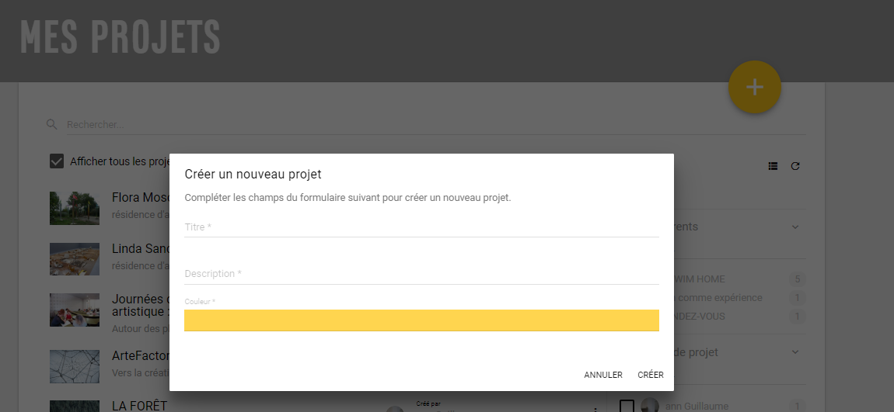

# Ajouter un nouveau projet

Suivant les droits utilisateurs qui vous ont été octroyés, vous avez la possibilité de créer un projet. Vous devez voir un icône Plus sur lequel il faut cliquer pour créer un nouveau projet.


Il est aussi possible de passer par le menu en haut à gauche de l'écran \(voir le lien Actions : Nouveau projet\)


La création d'un projet est très simple et demande juste de renseigner un titre et éventuellement une description. Par défaut une couleur est associée pour personnaliser le projet dans la mosaïque de la page d'accueil, mais il est possible dans la page **paramètres d'un projet** de changer la couleur par une image.

