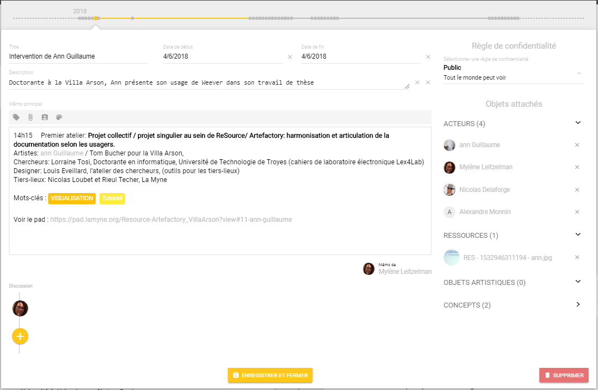

# Page Mon profil

 Avant toute interaction sur la plateforme Weever, il est important de renseigner son profil, l'adresse mail étant remplie lors de la premier connexion à l'enregistrement. Les champs usuels téléphone et adresse sont proposés. Il y a aussi un champ dédié à une petite bio pour se présenter.


 Par défaut, l'avatar du menu Profil reprend la première lettre du prénom, mais nous conseillons de télécharger votre propre avatar pour améliorer l'expérience utilisateur dans la communauté des membres de la Plateforme


