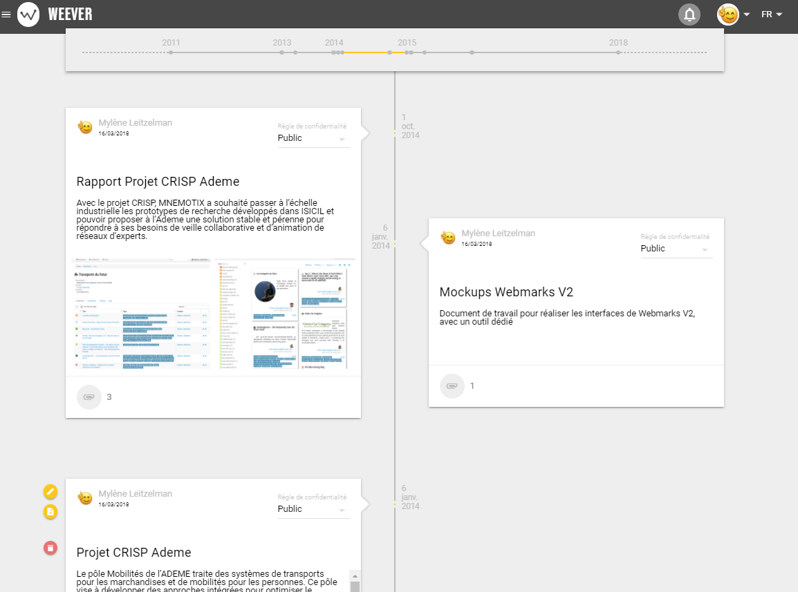

# Page projet

La page d'accueil d'un projet se présente principalement sous la forme d'une timeline, qui regroupe sur une ligne de temps des événements liés au projet. 

Ces événements peuvent être de diverses formes, un événement réel type réunion, meeting, conférences datées, ou un événement type recherche d'information, veille sur un sujet etc... considérés comme récurrents.

Ces** événements non datés** \(typiquement un événement régulier de curation par ex\) se trouvent classés en haut de la timeline. Pour les** événements datés**, ils se positionnent anté-chronologiquement sur la timeline.

